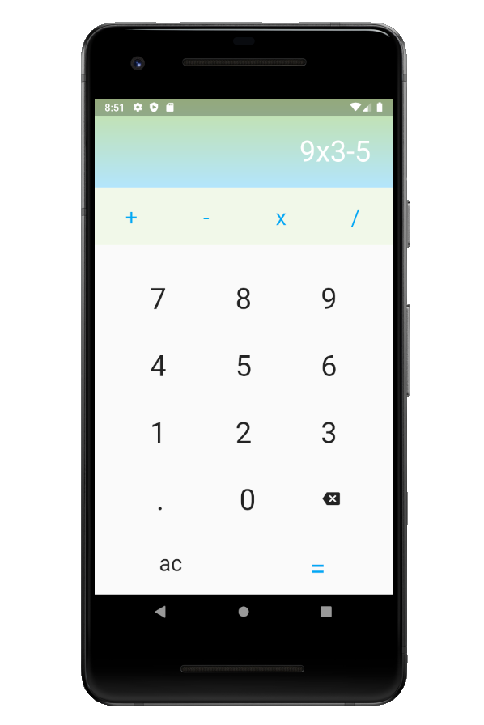

# Calculadora - Flutter

Aplicación movil de calculadora desarrollada en Flutter.

### Operaciones soportadas:

- Suma (+)
- Resta (-)
- Multiplicación (x)
- División (/)
- Reiniciar (ac)
- Backspace
- Calcular (=) operaciones con enteros y decimales

### Preview

